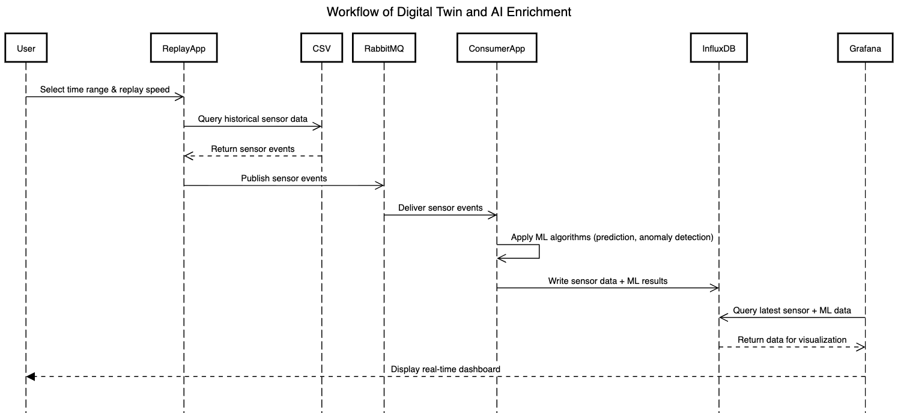
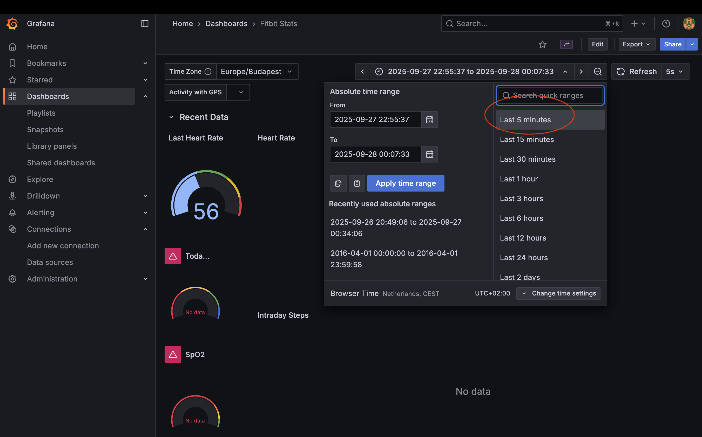

## Digital Twin Project

### 1. Dataset Selection

This dataset was generated by respondents to a distributed survey via Amazon Mechanical Turk between 2016-03-12 and 2016-05-12.  

For this project, we selected the **personal tracker data of a single user** (`userId: 5577150313`) covering the period between **April 1 and April 10, 2016**.  

The dataset includes outputs from **physical activity, heart rate, and sleep monitoring**, with measurements at different time resolutions (minute-level, hourly, or irregular intervals).  

🔗 Source: [Fitbit Dataset on Kaggle](https://www.kaggle.com/datasets/arashnic/fitbit/data)

---

#### Table Description

| Table Name                                            | Description                                                                                                                          | Unit / Scale                                   |
|-------------------------------------------------------|--------------------------------------------------------------------------------------------------------------------------------------|------------------------------------------------|
| [heartrate_seconds_merged.csv](activity_data_user_5577150313%2Fuser_5577150313_heartrate_seconds_merged.csv)| Heart beats collected at irregular time intervals (not per minute)                                                                   | beats per minute (bpm)                         |
| [minuteCaloriesNarrow_merged.csv](activity_data_user_5577150313%2Fuser_5577150313_minuteCaloriesNarrow_merged.csv)                                          | Calories burnt per minute                                                                                                            | kcal/min                                       |
| [minuteIntensitiesNarrow_merged.csv](activity_data_user_5577150313%2Fuser_5577150313_minuteIntensitiesNarrow_merged.csv)                                       | Activity intensity grouped into 4 categories:<br>• 0 = Sedentary<br>• 1 = Lightly Active<br>• 2 = Fairly Active<br>• 3 = Very Active | categorical (0–3), measured in minutes/distance |
| [hourlySteps_merged.csv](activity_data_user_5577150313%2Fuser_5577150313_hourlySteps_merged.csv)                                             | Number of steps recorded hourly                                                                                                      | steps/hour                                     |
| [minuteMETsNarrow_merged.csv](activity_data_user_5577150313%2Fuser_5577150313_minuteMETsNarrow_merged.csv)                                             | Metabolic Equivalent of Task: ratio of energy used in an activity vs. at rest                                                        | measured in minutes                            |
| [minuteSleep_merged.csv](activity_data_user_5577150313%2Fuser_5577150313_minuteSleep_merged.csv)                                             | Sleep duration and quality rating                                                                                                    | duration (minutes/hours), quality scale (1–3)  |

---

#### Notes
- The dataset reflects **minute-level outputs** for some measures (e.g., Calories), **hourly data** for others (e.g., Steps), and **irregular sampling** for HeartRate.  
- minute-level outputs for sleep quality can also be used for calculating the sleep duration per hour.  

---
### 2. System Architecture Overview


#### 2.1 Producer(replay app)
The producer module follows a layered design to separate RabbitMQ setup, data handling, and producer orchestration.
 1. RabbitMQPublisher: Handles all low-level RabbitMQ setup and connectivity, including: 
    - Declaring exchanges and queues
    - Binding queues to exchanges
    - Managing the channel and connection lifecycle
 2. BaseProducer: Provides a reusable template for producers bound to a specific queue. Defines how to:
    - Read or generate data
    - Encode the data (e.g., JSON)
    - Publish messages to the corresponding queue
 3. ProducerService: Configures and manages all producers.Responsible for:
    - Initializing each producer
    - Starting producer threads or async tasks
    - Supervising producer execution
#### 2.2 Consumer

 
---
### 3. Local Setup

This project simulates a digital twin environment with a Producer (sending heartbeat & activity data) and a Consumer (receiving messages, analyzing data, and exposing REST APIs).
The system uses RabbitMQ as the message broker.

0. Prerequisites
   * Python 3.9+
   * Docker (for RabbitMQ)

1. Install dependencies:
    ```bash
   pip install -r requirements.txt
   ```
   
2. Start Producer container, RabbitMQ, influxDB, and Grafana client (via Docker)

    ```bash
   docker-compose -p digital_twin -f docs/docker-compose.yml up
   ```

3. Running the Apps 
* Open two terminals in the project root (src/ folder).
  * Consumer Service: Consumes messages from RabbitMQ and exposes REST API endpoints.
    
  ``` bash
    # start consumer
    python src/app_consumer.py
  ```

4. open the grafana dashboard
    * http://localhost:3000
    * enter the username: admin and the password: admin123 (case sensitive)
    * get into the Fitbit dashboard 
    * choose the latest time frame
   
   
   

4. Stopping Services
* Stop RabbitMQ: <code>docker-compose -p digital_twin -f docs/docker-compose.yml down</code>
* Stop Producer/Consumer: Ctrl + C in their terminal windows.

---
### 4. InfluxDB Schema
Measurement: "Health_statics"

| **Field/Tag** | **Type**    | **Description**                                  | **Example**                                                                               |
|---------------|-------------|--------------------------------------------------|-------------------------------------------------------------------------------------------|
| **Tags**      |             |                                                  |                                                                                           |
| `user_id`     | string      | Unique user identifier                           | `"user_5577150313"`                                                                       |
| `type`        | string      | Data collection or AI implementation result      | `"measurement"`, `"ai"`                                                                   |
| `signal`      | string      | Type of signal                                   | `"heart_rate"`, `"calories"`, `"steps"`, `"sleep"`, `"heart_rate_status"`, `"intensities"` |
| **Fields**    |             |                                                  |                                                                                           |
| `past_time`   | int (epoch) | Original event timestamp                         | `1459468810`                                                                              |
| `value`       | float       | Signal value (numeric), type depends on `signal` | heart_rate: `55.0` (float); calories: `1.41` (float); steps: `10` (float);                |
| `int_value`   | int         |                                                  | sleep: `1` (int); heart_rate_status: `0` / `1` / `2` (int); intensities: `3` (int)        |
| **Timestamp** |             |                                                  |                                                                                           |
| `_time`       | timestamp   | InfluxDB write time (`.time(datetime.utcnow())`) | `2025-09-27T13:00:00Z`                                                                    |

📌 Notes

0. The 'type' tag:
   * 'measurement' refers to the data from producer. 
   * 'ai' refers to the ai implementation results.  

1. The 'signal' tag differentiates which sensor metric is being recorded.

2. Type of value:
* float → heart_rate, calories
* int → steps, sleep, heart_rate_status (0/1/2, stands for different types of abnormality), intensities

3. past_time preserves the original event time, while _time is the actual write timestamp managed by InfluxDB.